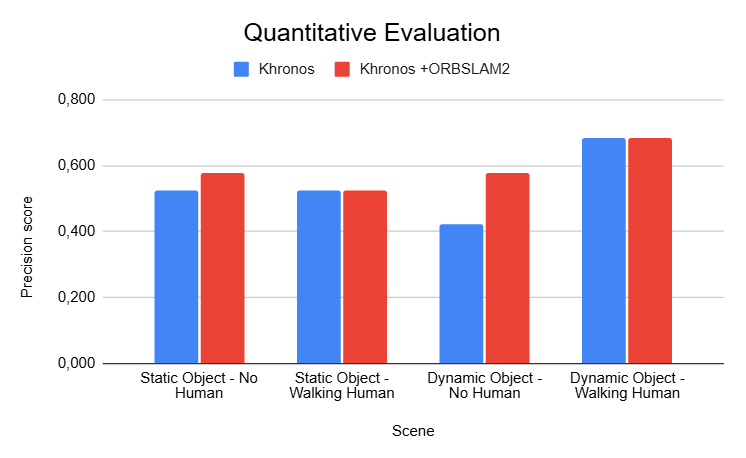

# Stretch Mapping: Proactive Mapping for Household Tidying

Welcome to **Stretch Mapping**, a semantic household tidying project using the Stretch robot. This project provides a proactive mapping framework that is usable for Stretch's indoor tasks in household environments.
🤖🧹👕🧸

[](https://www.python.org/)
[](https://github.com/NhiNguyencmt8/StretchMapping)
[](mailto:nnguyen349@gatech.edu)
[](https://hello-robot.com/stretch-3-product)
[](https://opensource.org/)
<a href="https://www.ros.org">
  
</a>


**Table of Contents**
- [Overview 👓](#overview)
- [Evaluation ✍🏼](#evaluation-)
- [Installation 🚀](doc/Installation.md)
  - [Setup a Catkin Workspace 🛠️](doc/Installation.md#setup-a-catkin-workspace-)
  - [Install System Dependencies 📦](doc/Installation.md#install-system-dependencies-)
  - [Clone the Repository 📂](doc/Installation.md#clone-the-repository-)
- [Usage 🎮](doc/Usage.md)
  - [Before Running Anything](doc/Usage.md#before-running-anything)
  - [Additional Setup for ADE20K Dataset 🖼️](doc/Usage.md#additional-setup-for-ade20k-dataset-)
- [Runing and Tuning Khronos](doc/Runing_and_Tuning_Khronos.md)
  - [Running Khronos with Bag Files (Offline) 🗂️](doc/Runing_and_Tuning_Khronos.md#running-khronos-with-bag-files-offline-)
  - [Running Khronos Live (Online) 🔴](doc/Runing_and_Tuning_Khronos.md#running-khronos-live-)
  - [Tuning Khronos](doc/Runing_and_Tuning_Khronos.md#tuning-khronos)
- [Results 📊](#results-)
- [Notice for Git Commits ⚠️](#notice-for-git-commits-)
- [Support 🤝](#support-)

## Overview 👓
This is a Stretch robot pipeline for proactive mapping that intergrates Khronos, semantic-inference and ORB_SLAM as a package.
This project introduces a unified pipeline for the Stretch robot that fuses **semantic-inference** and **ORB_SLAM** for proactive mapping. We leverage Khronos, a semantic segmentation module, to analyze and label environments in real time, providing rich contextual understanding for household navigation. Additionally, ORB_SLAM is employed to enhance the map's localization accuracy, ensuring precise alignment between the robot’s position and the generated semantic map. Evaluated with custom metrics, our pipeline demonstrates robust performance in mapping and localization, and we are open sourcing the complete codebase to support further advancements in household robotics research.

## Evaluation ✍🏼

This is main evaluation of the Stretch Mapping project, where we assess the performance of our proactive mapping pipeline in a household scenario with a person moving around the environment. The evaluation focuses on the integration of **Khronos** for semantic segmentation and **ORB_SLAM** for localization.


[](https://www.youtube.com/watch?v=9r7H5XKUNsc)

<!-- <div align="center">
   
</div> -->

---
## Results 📊

The Stretch Mapping project has shown promising results in proactive mapping and localization. The bar plot illustrates the object precision scores across various scenarios, comparing two configurations: Khronos with the robot's odometry (blue) and Khronos integrated with ORBSLAM2 (red). The results highlight that integrating ORBSLAM2 enhance precision in scenarios involving object displacement out-of-view. However, the two configurations perform comparably in scenarios with humans moving in view.

<div align="center">
   
</div>

### Mapping Results
The following images showcase the mapping results from different scenarios evaluated in the Stretch Mapping project. Each scenario highlights the robot's ability to map and understand its environment under various conditions.
1. [**Static Objects + No People in view**](./doc/Static_Objects_No_Person_inView.md):
   *The robot maps an apartment without dynamic objects or human presence.*
2. [**Static Objects + People in view**](./doc/Static_Objects_Person_in_View.md):
   *The robot maps an apartment with static objects and people visible in the scene.*
3. [**Displaced Objects + No People in view**](./doc/Displaced_Objects_No_Person_InView.md):
   *Objects are displaced around the scene (behind the robot) but no dynamic objects or people are present.*
4. [**Dynamic Objects + Person Walking in view**](./doc/Dynamic_Objects_Person_InView.md):
   *Objects are moved by a person while the robot maps the environment.*

## Notice for Git Commits ⚠️

**DON'T directly make changes to the submodules in the repository and expect them to be updated.** Since they are submodules, updates require a specific workflow. Instead, follow these steps:

1. Clone the submodule repository (e.g., for Khronos) and make changes:
   ```bash
   git clone git@github.com:<githubaccount>/Khronos.git
   cd Khronos
   # Make your changes here
   git add .
   git commit -m "Your changes"
   git push origin main
   ```

2. Navigate back to the StretchMapping repository:
   ```bash
   cd /path/to/StretchMapping
   ```

3. Update the submodule reference:
   ```bash
   git submodule status
   git submodule update --init --recursive
   cd Khronos
   git remote -v
   ```

   If the URL is incorrect or missing, set the correct remote:
   ```bash
   git remote set-url origin git@github.com:<githubaccount>/Khronos.git
   git fetch
   git checkout main
   ```

4. Update the submodule pointer in StretchMapping:
   ```bash
   cd ..
   git add Khronos
   git commit -m "Update Khronos submodule to latest revision"
   git push origin main
   git submodule update --remote --merge
   ```

---

## Support 🤝

If you have any questions, feel free to post an issue on this repo or please reach out to our contributers. We're happy to help!

## Contributors:
1. Harsh Muriki: -
2. Nhi Nguyen (Leona): yennhi1908hcm@gmail.com
3. Rahul Rustagi: rustagirahul24@gmail.com
