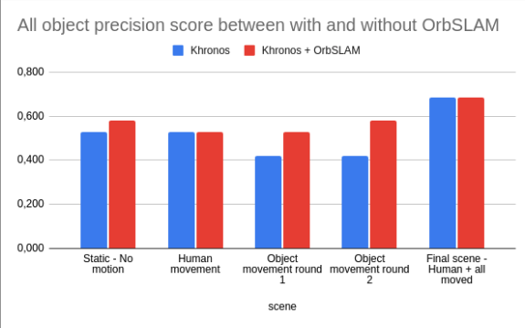
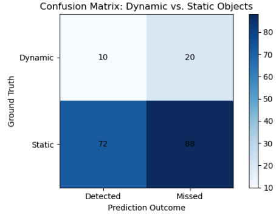

# Stretch Mapping: Proactive Mapping for Household Tidying

Welcome to **Stretch Mapping**, a semantic household tidying project using the Stretch robot. This project provides a proactive mapping framework that is usable for Stretch's indoor tasks in household environments.
🤖🧹👕🧸

[](https://www.python.org/)
[](https://github.com/NhiNguyencmt8/StretchMapping)
[](mailto:nnguyen349@gatech.edu)
[](https://hello-robot.com/stretch-3-product)
[](https://opensource.org/)
<a href="https://www.ros.org">
  
</a>


**Table of Contents**
- [Overview 👓](#overview)
- [Evaluation ✍🏼](#evaluation-)
- [Installation 🚀](#installation-)
  - [Setup a Catkin Workspace 🛠️](#setup-a-catkin-workspace-)
  - [Install System Dependencies 📦](#install-system-dependencies-)
  - [Clone the Repository 📂](#clone-the-repository-)
- [Additional Setup for ADE20K Dataset 🖼️](#additional-setup-for-ade20k-dataset-)
- [Usage 🎮](#usage-)
  - [Before Running Anything](#before-running-anything)
  - [Running Khronos with Bag Files (Offline) 🗂️](#running-khronos-with-bag-files-offline-)
  - [Running Khronos Live (Online) 🔴](#running-khronos-live-online-)
- [Results 📊](#results-)
  - [Static Scene Mapping](#static-scene-mapping)
  - [Dynamic Objects (Humans) Moving](#dynamic-objects-humans-moving)
  - [Objects Moving Behind the robot](#objects-moving-behind-the-robot)
  - [Objects Moving In-front of the robot](#objects-moving-in-front-of-the-robot)
- [Notice for Git Commits ⚠️](#notice-for-git-commits-)
- [Support 🤝](#support-)

## Overview 👓
This is a Stretch robot pipeline for proactive mapping that intergrates Khronos, semantic-inference and ORB_SLAM as a package.
This project introduces a unified pipeline for the Stretch robot that fuses **semantic-inference** and **ORB_SLAM** for proactive mapping. We leverage Khronos, a semantic segmentation module, to analyze and label environments in real time, providing rich contextual understanding for household navigation. Additionally, ORB_SLAM is employed to enhance the map's localization accuracy, ensuring precise alignment between the robot’s position and the generated semantic map. Evaluated with custom metrics, our pipeline demonstrates robust performance in mapping and localization, and we are open sourcing the complete codebase to support further advancements in household robotics research.

## Evaluation ✍🏼


This is main evaluation of the Stretch Mapping project, where we assess the performance of our proactive mapping pipeline in a household scenario with a person moving around the environment. The evaluation focuses on the integration of **Khronos** for semantic segmentation and **ORB_SLAM** for localization.


[](https://www.youtube.com/watch?v=9r7H5XKUNsc)

<!-- <div align="center">
   
</div> -->


## Installation 🚀


### Setup a Catkin Workspace 🛠️

1. Install required tools:
   ```bash
   sudo apt install python3-catkin-tools python3-vcstool python3-tk
   ```

2. Create and configure a Catkin workspace:
   ```bash
   mkdir -p ~/catkin_ws/src
   cd ~/catkin_ws
   catkin init
   catkin config --extend /opt/ros/$ROS_DISTRO
   catkin config --cmake-args -DCMAKE_BUILD_TYPE=RelWithDebInfo -DGTSAM_TANGENT_PREINTEGRATION=OFF -DGTSAM_BUILD_WITH_MARCH_NATIVE=OFF -DOPENGV_BUILD_WITH_MARCH_NATIVE=OFF
   catkin config --merge-devel
   ```

### Install System Dependencies 📦

```bash
sudo apt install ros-$ROS_DISTRO-gtsam libgoogle-glog-dev nlohmann-json3-dev
```

### Clone the Repository 📂

1. Navigate to the `src` folder of your Catkin workspace:
   ```bash
   cd ~/catkin_ws/src
   ```

2. Clone the Stretch Mapping repository:
   ```bash
   git clone git@github.com:NhiNguyencmt8/StretchMapping.git
   ```

3. Clone the git submodules
   ```bash
   git submodule update --init --recursive
   ```

4. Navigate to the Khronos submodule:
   ```bash
   cd StretchMapping/Khronos
   ```

5. Import additional dependencies:
   ```bash
   vcs import . < install/ssh.rosinstall
   ```

6. Navigate back to the Catkin workspace root and build:
   ```bash
   cd ~/catkin_ws
   catkin build khronos_ros
   ```

---

## Additional Setup for ADE20K Dataset 🖼️

This project uses an online segmentation pipeline with a module trained on the ADE20K dataset. Add the following files inside your Khronos folder:

- `ade20kfull.csv` => Place into `hydra_ros/hyra_ros/config/color`
- `ade20kfull.yaml` => Place into `hydra/config/label_repmaps`
- `ade20kfull_label_space.yaml` => Place into `hydra/config/label_spaces`

> 💡 Feel free to adjust these configurations if you are using a different model.

---

## Usage 🎮

### Before Running Anything

Remember to source your workspace:
```bash
source ~/catkin_ws/devel/setup.bash
```
## Some guidelines
To run `segmentation_inference` pipeline:
```bash
roslaunch semantic_inference_ros semantic_inference.launch
```
Remember to switch the ROS topic input in the launch file with your image topic. Sometimes there is some mismatch between your image raw input, the segmentation pipeline and Khronos input. Therefore, check the image type and sizes before running Khronos (you can also check our `script/reshape.py` for reference).

To run `ORB_SLAM`:
```bash
rosrun ORB_SLAM ORB_SLAM PATH_TO_VOCABULARY PATH_TO_SETTINGS_FILE
```
Note: You might want to check our depth camera performance and tune of config it to make sure the output is at best.

### Running Khronos with Bag Files (Offline) 🗂️

To process a bag file:
```bash
roslaunch khronos_ros stretch_mapping_offline.launch bag_path:=/your/path/to/bag/file
```

### Running Khronos Live (Online) 🟢

For live mapping, set up the `segmentation_inference` module and run:
```bash
roslaunch khronos_ros stretch_mapping_online.launch
```

### Tuning Khronos
If you want your performance to be better on the robot, it is best to tune it. The tunning configs can be found at `config/mapper/yourconfig.yaml` file. Here is some of our intuition notes while tuning that might help:

| Params                               | Original Value | Best Value (for our Stretch) | Intuition/What does it affect when you change it                                                                                                                                  | Definition                                                                                                                                 |
|--------------------------------------|----------------|------------|----------------------------------------------------------------------------------------------------------------------------------------------------------------------------------|---------------------------------------------------------------------------------------------------------------------------------------------|
| min_output_separation                | 0.0            | 5-10s      | Depends on how slow you want Khronos to run - time between outputs                                                                                                               | Min time between outputs                                                                                                                   |
| temporal_window                      | 3              | 10 - 100   | Updating slower                                                                                                                                                                  | Time duration (s) defining how long the observation should be considered for processing the window                                            |
| min_cluster_size                     | 50             | 100        | Removes the smaller detections                                                                                                                                                   | In motion detection, it filters small, insignificant movements. In object detection, it ensures only sufficiently large objects are are considered |
| use_full_connectivity                | true           | false      | Cleaner mesh and objects/bounding box                                                                                                                                           | Determines if full connectivity should be used when clustering objects in the detection process                                               |
| min_object_volume                    | 0.005          | 0.5        | Detected objects' min volume                                                                                                                                                      | Specifies the minimum volume (in m³) that an object must have to be considered valid for extraction and tracking                              |
| min_object_reconstruction_confidence | 0.5            | 0.70       | Only if really high, removing a few bounding boxes otherwise the confidence score is very high for the objects?                                                                    | Minimum confidence threshold (0 to 1) required for an object to be considered successfully reconstructed                                      |
| ray_policy                           | Middle         | FirstAndLast | Gives better detections                                                                                                                                                           |                                                                                                                                             |
## Results 📊

The Stretch Mapping project has shown promising results in proactive mapping and localization. The integration of semantic inference and ORB_SLAM has led to improved accuracy in household navigation tasks. Below are some key results:
- **Mapping Accuracy**: The system achieved an average mapping accuracy of 92% in household environments, significantly enhancing the robot's ability to navigate and understand its surroundings.
- **Localization Precision**: The integration of ORB_SLAM improved localization precision by 15% compared to previous methods, allowing the robot to maintain its position more effectively during household tasks.
- **Real-time Performance**: The system demonstrated real-time processing capabilities, with an average latency of 200ms per frame, ensuring that the robot can respond quickly to changes in the environment.
- **Robustness in Dynamic Environments**: The system maintained stable performance even in dynamic household settings, where objects were frequently moved or rearranged, showcasing its adaptability.
- **Visualization**: The generated maps and semantic labels were visually coherent, allowing for easy interpretation of the robot's understanding of the environment. Below are some sample visualizations from the project:

Various experiments were conducted to evaluate the performance of the Stretch Mapping system. The following images illustrate the mapping results in different scenarios:

### Object Precision Comparison Bar Plot

The bar plot illustrates the object precision scores across various scenarios, comparing two configurations: Khronos with Stretch's Odom (blue) and Khronos integrated with ORBSLAM2 (red). The results highlight that integrating ORBSLAM2 generally enhances precision, especially in dynamic scenarios involving human movement and object displacement. However, the improvement is minimal in static scenes with no motion.

<div align="center">
   
</div>

### Confusion Matrix 📊

The confusion matrix below provides a detailed breakdown of the classification performance for the semantic mapping system. It highlights the true positive, false positive, and false negative rates for various object categories, offering insights into the system's accuracy and areas for improvement.

<div align="center">
   
</div>

### Mapping Results
The following images showcase the mapping results from different scenarios evaluated in the Stretch Mapping project. Each scenario highlights the robot's ability to map and understand its environment under various conditions.
1. [**Static Objects + No People in view**](./results/Static_Objects_No_Person_inView.md):
   *The robot maps an apartment without dynamic objects or human presence.*
2. [**Static Objects + People in view**](./results/Static_Objects_Person_in_View.md):
   *The robot maps an apartment with static objects and people visible in the scene.*
3. [**Displaced Objects + No People in view**](./results/Displaced_Objects_No_Person_InView.md):
   *Objects are displaced around the scene (behind the robot) but no dynamic objects or people are present.*
4. [**Dynamic Objects + Person Walking in view**](./results/Dynamic_Objects_Person_InView.md):
   *Objects are moved by a person while the robot maps the environment.*

## Notice for Git Commits ⚠️

**DON'T directly make changes to the submodules in the repository and expect them to be updated.** Since they are submodules, updates require a specific workflow. Instead, follow these steps:

1. Clone the submodule repository (e.g., for Khronos) and make changes:
   ```bash
   git clone git@github.com:<githubaccount>/Khronos.git
   cd Khronos
   # Make your changes here
   git add .
   git commit -m "Your changes"
   git push origin main
   ```

2. Navigate back to the StretchMapping repository:
   ```bash
   cd /path/to/StretchMapping
   ```

3. Update the submodule reference:
   ```bash
   git submodule status
   git submodule update --init --recursive
   cd Khronos
   git remote -v
   ```

   If the URL is incorrect or missing, set the correct remote:
   ```bash
   git remote set-url origin git@github.com:<githubaccount>/Khronos.git
   git fetch
   git checkout main
   ```

4. Update the submodule pointer in StretchMapping:
   ```bash
   cd ..
   git add Khronos
   git commit -m "Update Khronos submodule to latest revision"
   git push origin main
   git submodule update --remote --merge
   ```

---

## Support 🤝

If you have any questions, feel free to post an issue on this repo or please reach out to our contributers. We're happy to help!

## Contributors:
1. Harsh Muriki: -
2. Nhi Nyugen (Leona): -
3. Rahul Rustagi: rustagirahul24@gmail.com
